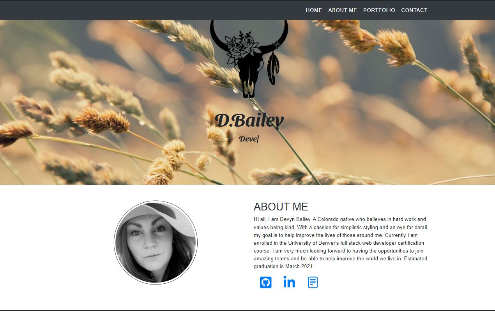

# Application: db_react_portfolio

## Application Description: 
An updated React version of my personal portfolio. Featuring React, Bootstrap and EmailJS. 
Additional React packages include: 
- react-hook-form
- react-icons
- react-popupbox
- react-scripts
- react-scroll
- react-typed

## Table of Contents

- [Usage](#usage)
- [Screenshot](#screenshot)
- [Contributing](#contributing)
- [Resources](#resources)
- [Questions](#questions)

## Usage

To access portfolio via GitHub link visit: https://dbailey11.github.io/db_react_portfolio/

## Screenshot

## Contributing

This application is not open for other developer contribution.

## Resources

Andrey Dovganyuk videos:
- Udemy: https://www.udemy.com/user/andrew1119/
- Youtube: https://www.youtube.com/8020coding

## Questions

- If you have any questions please feel free to email me or stop by on my GitHub!
- Find me on GitHub: (https://github.com/dbailey11/)
- Email me: baileydevyn19@gmail.com
